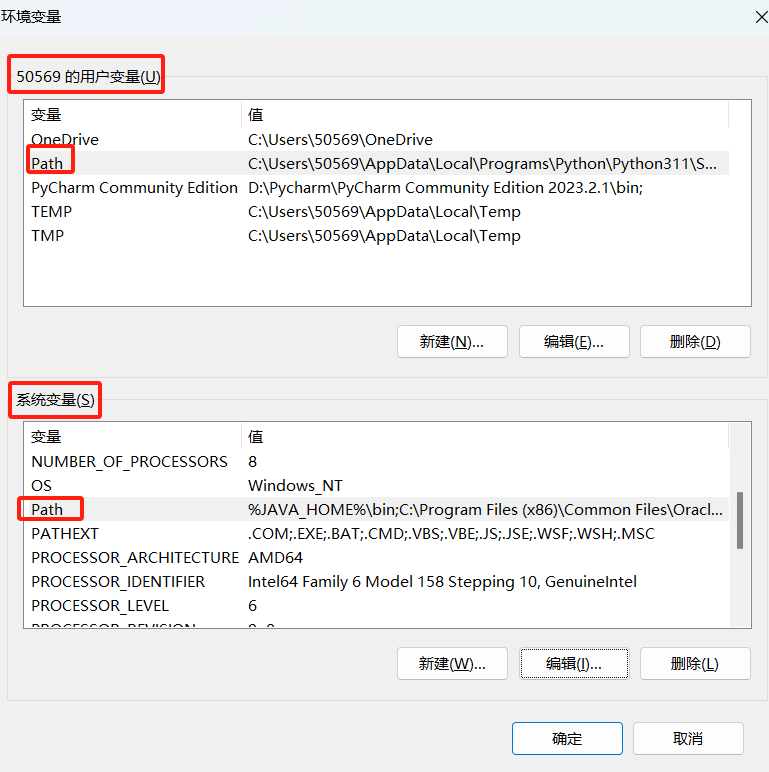
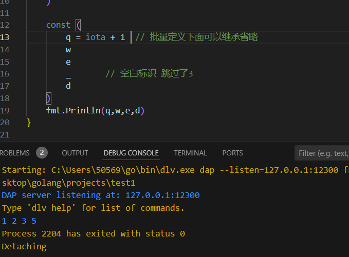

# 1 安装GO

## 1.1 安装GO运行环境

```
https://go.dev/
https://golang.google.cn/
```


### 1.1.1 基础知识扫盲

```bash
#win有两个版本msi版本不需要修改PATH路径
命令行输入go:
	在当前OS环境中查找命令（可执行文件），但目录太多不方便使用，所以依赖于PATH指定的路径。操作系统会去PATH指定的所有目录找go，找不到报错。windows优先再当前目录，找不到才去找PATH。

环境变量: 操作系统运行环境中提前定义好的变量
	PATH：如果你在命令行输入一端字符，shell解析它，被解释为可执行的文件（命令）：
	GOROOT: GO的安装路径
	GOPATH: 当前用户家目录 $HOME/go (第三方包安装路径)
	PATH: %USERPROFILE%/go/bin = GOPATH + bin = /root/go/bin
		win中的%USERPROFILE% = 家目录
		bin = binary 二进制/编译完成的可执行文件
		GOROOT + bin
	pkg目录:缓存第三方包文件bin日录:第三方包通过go install命令下载并编译好的可执行文件的存放
	go install命令:下载第三方包到$GOPATH/go/下面的缓存包文件们到该目录，编译好可执行文件放到$GOPATH/go/bin
	go get命令:下载第三方包到$GOPATH/g0/下面的缓存包文件们到该目录，以后编程用这些包


#查看win变量
win + r -- cmd -- 输入set

Path=C:\Program Files\Java\jdk1.8.0_281\bin;C:\Program Files (x86)\Common Files\Oracle\Java\javapath;C:\Program Files\Java\jdk-1.8\bin;D:\VM17.0\bin\;C:\Program Files (x86)\Common Files\Intel\Shared Libraries\redist\intel64\compiler;C:\Windows\system32;C:\Windows;C:\Windows\System32\Wbem;C:\Windows\System32\WindowsPowerShell\v1.0\;C:\Windows\System32\OpenSSH\;C:\Program Files (x86)\NVIDIA Corporation\PhysX\Common;C:\Program Files\NVIDIA Corporation\NVIDIA NvDLISR;C:\WINDOWS\system32;C:\WINDOWS;C:\WINDOWS\System32\Wbem;C:\WINDOWS\System32\WindowsPowerShell\v1.0\;C:\WINDOWS\System32\OpenSSH\;C:\Program Files\dotnet\;D:\XshellXftp\Xshell\;D:\XshellXftp\Xftp\;E:\Xmanager\;C:\Users\50569\AppData\Local\Programs\Python\Python311\Scripts\;C:\Users\50569\AppData\Local\Programs\Python\Python311\;C:\Users\50569\AppData\Local\Microsoft\WindowsApps;;D:\Pycharm\PyCharm Community Edition 2023.2.1\bin;;E:\vscode\Microsoft VS Code\bin
```


#### 1.1.1.1 通用添加环境变量mac/linux

```bash
#默认
GOPROXY缺省是https://proxy.golang.org,direct
#go1.16之后不用配置
go env -w GO111MODULE=On
#Go Module代理加速仓库服务
go env -w GOPROXY=https://mirrors.aliyun.com/goproxy/

#验证
go env 
```


### 1.1.2 win安装 

#### 1.1.2.1 配置PATH路径

```bash
#使用msi版本的安装方法会自动配置PATH --> 下载包 --> 然后解压到指定的目录
此电脑--右击--高级系统设置
```


**一个是当前用户PATH/一个是全局PATH**




#### 1.1.2.1 windows配置方法


### 1.1.3 linux安装

#### 1.1.3.1 解包

```bash
wget https://dl.google.com/go/go1.22.2.linux-amd64.tar.gz
tar xvf go1.22.2.linux-amd64.tar.gz -C /usr/local
```

#### 1.1.3.2 设置环境变量

```bash
export PATH:$PATH:/usr/loacl/go/bin/
export GOPROXY=https://mirrors.aliyun.com/goproxy/
export GOROOT=<go安装路径>
export GOPATH=$HOME/go
export PATH=$PATH:$GOROOT/bin/  	 #go程序在这里
export PATH=$PATH:$GOPATH/go/bin/	 #三方依赖默认存在这里
#验证
go env 
go version
```


#### 1.1.3.3 设置环境变量 七牛云

```
Go 1.13 及以上（推荐）

打开你的终端并执行

$ go env -w GO111MODULE=on
$ go env -w GOPROXY=https://goproxy.cn,direct
完成。

macOS 或 Linux

打开你的终端并执行

$ export GO111MODULE=on
$ export GOPROXY=https://goproxy.cn
或者

$ echo "export GO111MODULE=on" >> ~/.profile
$ echo "export GOPROXY=https://goproxy.cn" >> ~/.profile
$ source ~/.profile
完成。

Windows

打开你的 PowerShell 并执行

C:\> $env:GO111MODULE = "on"
C:\> $env:GOPROXY = "https://goproxy.cn"
或者

1. 打开“开始”并搜索“env”
2. 选择“编辑系统环境变量”
3. 点击“环境变量…”按钮
4. 在“<你的用户名> 的用户变量”章节下（上半部分）
5. 点击“新建…”按钮
6. 选择“变量名”输入框并输入“GO111MODULE”
7. 选择“变量值”输入框并输入“on”
8. 点击“确定”按钮
9. 点击“新建…”按钮
10. 选择“变量名”输入框并输入“GOPROXY”
11. 选择“变量值”输入框并输入“https://goproxy.cn”
12. 点击“确定”按钮
```


## 1.2 安装GO开发环境

```c
商业：Goland
免费：VSCode（JS ES TS开发第一工具） go语言/伟哥推荐 
     https://code.visualstudio.com/Download
```

### 1.2.1 安装Vscode

无脑安装向导


#### 1.2.1.1 Vscod配置

```bash
#直接在扩展中搜索 go插件
```

新建项目（开发根目录）


```bash
#安装完go会自动弹出强依赖也要安装
install all = 调试编译开发全部安装
```


```
gopls和glv最重要一定要确保他俩安装成功
go install 第三方包下载到 GOPATH指定下目录下，编译好可执行文件放到GOPATH/go/bin/
	下载第三方包 -- 编译 
go get 
	直接下载到GOPATH指定下目录下，以后编程用这些
```


```bash
#vscode 命令行
ctrl + j
```


**如果下载失败尝试手动安装 或者更换GOPROXY的代理地址**

```bash
#官网地址
https://pkg.go.dev/golang.org/x/tools/gopls
go clean -modcache

#必须安装
go install -v github.com/go-delve/delve/cmd/dlv@latest
go install -v golang.org/x/tools/gopls@latest
#不是必须，代码语法检测
go install -v honnef.co/go/tools/cmd/staticcheck@latest
```

**安装完检查**


#### 1.2.1.2 hello-word

```go
package main

import "fmt"

func main() {
	fmt.Println("hello-word")
}

//运行
go run main.go

//调试Vscode  F5(自动保存+编译+调试)
如果按 F5 报错
//确保在项目的根目录 在TERMINAL输入 go mod init www.zed.org
Build Error: go build -o c:\Users\50569\Desktop\golang\project\test\__debug_bin3602295647.exe -gcflags all=-N -l .
go: go.mod file not found in current directory or any parent directory; see 'go help modules' (exit status 1)
```


会生成一个go mod文件


#### 优化配置


**安装插件** 

outline map

提高代码阅读效率

curl + 左键


postfix 补全代码


# 2 初识GO语言

## 2.1 GO命令

```go
go install  //下载第三方包到$GOPATH/g0/下面的缓存包文件们到该目录，编译好可执行文件放到$GOPATH/go/bin
go get 		//下载第三方包到SGOPATH/go下面的缓存包文件们到该目录，以后编程用这些包。如果开启了go模块，包依赖记录在go.mod中
	-u 更新包
go mod		//包管理
	go mod init <name>
	go mod tidy   //扫描当前项目，把go.mod文件中不依赖的第三方包删除，也可以把依赖的第三方包加入

go env
go version
go build 	 //编译
	-o 指定文件
go run		 //编译+运行

fmt 自动格式化代码  gols自动支持
```


## 2.2 项目结构

官方没有提供布局方案


## 2.3 计算机基础


```
冯诺依曼体系五大部件
	CPU:
	运算器
		一般给的一个任务，cpu要花几个震荡周期完成。主频越高越好
		假设3个滴答完成一次计算，请问频率高、低哪个省时间?主频越高越好，但是频率有天花板，所以上多核
	控制器
总线Bus：数据总线、控制总线 
存储器Memory:内存，掉电丢失，速度快
	运行内存:掉电丢失的芯片
	内部存储内存:相当于掉电不丢失的硬盘
	线性编地： 类似于门牌号对应一个内存地址 102 103 看下图
	
	
输入设备Input:数据输入
输出设备output:
输入输出设备不能和CPU直接打交道，CPU必须通过和内存交互进行数据交换。因为cpu中没有大量存储的空间。
	寄存器：为了本次计算所需数据服务
	缓存：cache（为了加速计算，预读取指令）Mb
	CPU亲缘性 避免CPU切换无法充分利用缓存
		1、2KB、3多核共享缓存
显卡：数字信号输入给显卡，显卡输出到显示器 
主板：骨架、神经系统

芯片组：
时钟振荡器
	脉冲信号，触发数字电路工作，频率越快CPU越快
	所有的数字设备都要利用产生的脉冲信号工作
	CPU运行频率是最高的3.xGhz
	
运行速度
CPU -- 内存（TB） 
IO设备，相对内存很漫 硬盘(PB)  固态 相对内存都特别慢

内存快但是掉电丢失 成本高
硬盘慢，但是可以持久化数据

除非有必要尽量在内存中读写，可以提高性能

程序向CPU发送指令  CPU找内存要数据 把需要的数据提前加载的内存中的cache中
```


**CPU并不直接从速度很慢的I0设备上直接读取数据，CPU可以从较慢的内存中读取数据到CPU的寄存器上运算器**
CPU计算的结果也会写入到内存，而不是写入到I0设备上


强类型语言

必须编译


弱类型  python  shell

强类型  C GO java

- 数据声明必须指定明确类型

- 不支持隐式类型转换，类型转换必须强制

- 代码编译成本地可执行代码

- 不需要虚拟机来运行
- 支持垃圾回收

### 不会写作业，刚开始，不要看答案，不会写，写中文写思想


# 3 GO基础语法

## 3.1 注释

```go
// 多行注释
/*
	a
	b
	a b c
*/


// TODO： 未完成任务
// NOTE： 请注意
// Deprecated： 告诉别人已经废弃了
// 一行一句代码

package main

import "fmt"

func main() {
	fmt.Println("lixijun")
	// TODO 未完成
}

```


## 3.2 命名规范

```bash
#大驼峰 如果要在包内外可见，就采用大驼峰命名
UserName
#小驼峰 如果只在包内可用，就采用小驼峰命名
userName
#sank
user_name

#条件变量、循环变量可以是单个字母或单个单词，Go倾向于使用单个字母。Go建议使用重短小

#常量用驼峰
在其他语言中，常量多使用全大写加下划线的命名方式，Go语言没有这个要求
对约定俗成的全大写，例如PI

函数/方法的参数、返回值应是单个单词或单个字母、函数可以是多个单词命名、类型可以是多个单词命名

方法由于调用时会绑定类型，所以可以考虑使用单个单词
包以小写单个单词命名包名应该和导入路径的最后一段路径保持一致
接口优先采用单个单词命名一般加er后缀。Go语言推荐尽量定义小接口，接口也可以组合
```


## 3.3 关键字

```bash
https:/lgolang.google.cn/ref/spec
#不能乱改
```

Go自己要用的

| 序号 | 关键字        | 说明                                                 |
| ---- | ------------- | ---------------------------------------------------- |
| 1    | `break`       | 用于终止最近的 `for` 或 `switch` 语句。              |
| 2    | `case`        | 用于定义 `switch` 语句的一个分支。                   |
| 3    | `chan`        | 用于声明通道，通道是一种允许并发程序之间通信的类型。 |
| 4    | `const`       | 用于声明常量。                                       |
| 5    | `continue`    | 跳过当前循环的剩余代码，直接开始下一次循环。         |
| 6    | `default`     | 用于定义 `switch` 语句中的默认分支。                 |
| 7    | `defer`       | 用于安排一个函数在调用它的函数退出前执行。           |
| 8    | `else`        | 用于定义 `if` 语句的“否则”分支。                     |
| 9    | `fallthrough` | 用于 `switch` 语句中，表示继续执行下一个 `case`。    |
| 10   | `for`         | 用于创建循环。                                       |
| 11   | `func`        | 用于声明函数。                                       |
| 12   | `go`          | 用于启动一个新的并发线程，称为 goroutine。           |
| 13   | `goto`        | 跳转到程序中的指定行。                               |
| 14   | `if`          | 用于执行条件判断。                                   |
| 15   | `import`      | 用于导入其他包。                                     |
| 16   | `interface`   | 用于定义接口。                                       |
| 17   | `map`         | 用于声明映射类型。                                   |
| 18   | `package`     | 用于定义包。                                         |
| 19   | `range`       | 用于迭代数组、切片、映射和通道。                     |
| 20   | `return`      | 用于从函数返回。                                     |
| 21   | `select`      | 用于创建多个通道操作的并发形式。                     |
| 22   | `struct`      | 用于定义结构体。                                     |
| 23   | `switch`      | 用于执行多个 `case` 的条件分支选择。                 |
| 24   | `type`        | 用于定义类型。                                       |
| 25   | `var`         | 用于声明变量。                                       |


## 3.4 预定义标识符

```bash
https://golang.google.cn/ref/spec#Predeclared identifiers
#可以但别
```


| 标识符       | 说明                                                 |
| ------------ | ---------------------------------------------------- |
| `bool`       | 布尔类型，表示真或假。                               |
| `byte`       | 8位的整数，代表一个ASCII码。                         |
| `complex64`  | 复数类型，由两个32位浮点数表示实部和虚部。           |
| `complex128` | 复数类型，由两个64位浮点数表示实部和虚部。           |
| `error`      | 错误类型，用于错误处理。                             |
| `float32`    | 32位浮点数。                                         |
| `float64`    | 64位浮点数。                                         |
| `int`        | 普通整数，大小取决于运行环境的架构（32位或64位）。   |
| `int8`       | 8位整数。                                            |
| `int16`      | 16位整数。                                           |
| `int32`      | 32位整数。                                           |
| `int64`      | 64位整数。                                           |
| `rune`       | 代表一个Unicode码点的整数类型。                      |
| `string`     | 字符串类型，由一系列字节组成。                       |
| `uint`       | 无符号整数，大小取决于运行环境的架构（32位或64位）。 |
| `uint8`      | 8位无符号整数。                                      |
| `uint16`     | 16位无符号整数。                                     |
| `uint32`     | 32位无符号整数。                                     |
| `uint64`     | 64位无符号整数。                                     |
| `uintptr`    | 无符号整数，用于存储指针的二进制表示。               |


## 3.5 内置函数

| 标识符    | 说明                                 |
| --------- | ------------------------------------ |
| `make`    | 用于创建切片、映射和通道。           |
| `new`     | 用于分配一个类型的新实例。           |
| `len`     | 获取字符串、切片、映射或通道的长度。 |
| `cap`     | 获取切片或通道的容量。               |
| `append`  | 用于追加元素到切片。                 |
| `copy`    | 用于复制切片内容。                   |
| `close`   | 关闭一个通道。                       |
| `complex` | 创建一个复数。                       |
| `real`    | 返回复数的实部。                     |
| `imag`    | 返回复数的虚部。                     |
| `panic`   | 触发一个运行时恐慌。                 |
| `recover` | 用于从恐慌中恢复。                   |


## 3.6 标识符

- 一个名字，本质上是个字符串，用来指代一个值
- 只能是大小写字母、数字、下划线，也可以是Unicode字符
- 不能以数字开头
- 不能是Go语言的关键字
- 尽量不要使用“预定义标识符"，否则后果难料
- 大小写敏感

**建议**

不要使用中文非必要不要使用拼音，尽量遵守上面的命名规范，或形成一套行之有效的命名规则。


```bash
#什么是标识符
a = 100  a指代100, a就是就是代表100的名称，a = 100 的标识符
100是数字，常量，不可变的值  字面常量
100+1=101，100还是那个100，1还是那个1，101就是101
并没有修改 100 也没有修改1 而是出现了一个新的值

 100 + 1  100 + 2 100 + 3 替换成  a + 1  a + 2  a + 3 


如果
a = 200 说明a背后指代的值可以变化（a变了）；所以可以变化的指代值的标识符，称为变量标识符
如果说a的指代一旦关联，不可变，a这个标识符指代的值不能改变了，称为常量标识符
```


## 3.7 字面常量

它是值，不是标识符，但本身就是常量，不能被修改。

Go语言中，boolean、rune、integer、float、complex、string都是字面常量。其中，rune（int32）、integer、flaat、complex常量被称为数值常量。

```
数字1就是1，数字100就是100，两个加起来=101 但是来的1 和 100 并没有改变


"ab" + "c" = "abc"  ab还是以前的ab，c也是c 得出一个新的值是 abc (字符串类型)

‘ab’  ‘c’  （字符类型）只能放一个字符

true false iota

var 变量名
const常量名= 初值 常量必须在定义是直接赋初值

const c ="abc“
const d int = 100 //字面常量100关联
const e uint8 = 100 // 右边无类型常量100 ，和左边有类型常量uint8e关联
// int 8bits -- 1bytes -128~127 -- 0~255

const d  = ”100“ // 类型推导 根据右边推断左边
const d  = 100   // 默认推导为 int   int 和 uint8两码事

如果左边没有指定类型，会根据右边的默认类型推导出他的类型。
字面常量本身是有类型的，
```

以上字面常量在Go中也被称为无类型常量untyped constant.无类型常量的缺省类型为bool、rune、int、float64、complex128或字符串,

注意:Go语言的常量定义，必须是能在编译器就要完全确定其值，所以，值只能使用字面常量。这和其他语言不同!例如，在其他语言中，可以用常量标识符定义一个数组，因为常量标识符保证数组地址不变，而其内元素可以变化。但是Go根本不允许这样做。


```go
在go语言中值有类型之分 
	无类型常量untyped constant
		无类型并不不是真的没有，而是有默认值；
		const a int = 101 // 正常写法
		const(   		  // 推导写法，根据右边数值的缺省类型推导出左边标识符的类型
			b = "abc"
			c = 100
		)

const a = "abc" 赋值语句
// 右边是无类型常量，它的缺省类型是string，左边a没有指定类型，a会进行类型推导，会依赖右边的类型，所以a被推测为string类型
```


## 3.8 iota

```
iota 批量定义常量
是从成批的第一个常量开始计数
```





范例：

```go
// 单独iota 从0开始
const a = iota	// 0 
const b = iota	// 0 
```


```go
// 批量定义
const (
	SUN = iota // 0
	MON = iota // 1
	TUE = iota // 2	
)

const (
	SUN = iota // 0
	MON
	TUE
)

const(
	a = iota // 0
	b 		// 1
    c		// 2
    _		// 按道理是3，但是丢弃了
    d		// 4
    e = 10  // 10
    f		// 10
    g = iota// 7
    h		// 8

)


const(
	m = 0          // iota = 0 * 2
    n			   // iota = 1 * 2
    a = 2 * iota   // iota = 2 * 2
    b			   // iota = 3 * 2
    c        	   // iota = 4 * 2
    d			   // iota = 5 * 2
)

a b c d 分别是 4 6 8 10
```


```
其他语言
const a = [1,2]

在go语言中，常量不可以定义数组
var a = [3]int{100,200,300}  // 代表定义变量 指定数组中有三个元素，而且必须是int类型

const a = [2]int{100,200}  报错
{}可以在花括号写元素
Go语言的常量定义，必须是能在编译器就要完全确定其值，所以，值只能使用字面常量。(必须给定值而且不能变)
但是数组的值可以更换，违背了const，所以在go中只能定义为var

其他语言是按照开头只要开头指向的内存地址不变那么就可以定义为常量

```


## 3.9 常量

```
cpu要使用的数值都要放在内存里面，因为磁盘太慢了。
“abc” 可以直接使用，但是如果是100个字符每次都用手敲很麻烦，所以我们可以给100个字符 起一个名字标识符
a = "100个字符" 后续使用我们用a指代100个字符。
“100” 是我给定的值 是我写出来的值 = 字面常量
我给定的值 计算机拿去运算比如 a + 1 = 101  并不会改变我们原来a的值  而是诞生了一个新的值
我可以给 a 这个标识符赋值 让他代表 100 这个字面常量

如果a的指代可以变化=变量
如果a的指代不可以变化 = 常量 但也可能是a有类型要求，同类型可以再次赋值=变量


如果不可以
	a有类型要求，不可以改变类型，同类型可以再次赋值，
	a是变量a就是不可以再被赋值，a和第一个赋给它的值之间的联系不可改变，a称为常量标识符
	
	
在其他语言中
	const a = [11,22]
	const a = [11,22,33]
	const a = [1231]
	可以这样玩，因为a指向内存中的数组开头的地址没变
	
在GO语言中
	const a = [2]int{1,2}
	必须指定数组的长度，但数组中的值可以变，长度不能变，因此不能被定义为常量。
	数组好比是一个容器 里面可以存放多个元素，元素可以变。可变就不能定义为常量
```


定义：

```ABAP
常量:标识符的指向的值一旦建立，不可改变，要求定义是必须建立关联
变量:标识符的指向的值建立后，可以改变
	1类型也可以变，往往动态语言JS、Python，举例a=100，a="abc",a=[1,2,3]
	2只能同类型可变
```


## 3.10 变量


```go
func main(){
	var a = 100
		a = 200
}

func main(){
	var a  		// 错误 因为GO是强类型语言，需要定义类型，但右边没有字面常量，无法根据默认类型推导a的类型
	var a int   // 正确 虽然没有赋值但是给定了类型。 GO特性 零值可用
    const b int // 错误 常量没有零值可用
    var a = 100 // 重复定义 不可以
}


常量可以批量定义，因为他会继承上一个赋值语句，可以进行类型推导。
变量批量定义必须要指定类型，因为它可以为空，为空就不能推导，不能确定类型，就报错哦。

var a int , b int // 错误
var a,b int // 可以 如果要写在一行，必须同类型，并且在最后指定类型
var a,b int = 100,200 //正确 要一起赋值
var(
	a int 
    b int 
)
```


### 3.10.1 短格式变量

```go
func main(){
	a := 100 // 短格式 变量定义 = 定义了变量标识符a 右边可以推导出类型 a 的类型
    a,b，c := 100,"avc".'d'// 短格式批量定义，依次对应推导   定义 赋值 推导
    
    a,b = b,c // 纯粹的赋值 没有类型推导  要注意类型，类型不同会报错
}

短格式只能写在func中，不能再全局中定义
```


**注意：**

```
变量的定义赋值 从右往左边，右边的值先定下来，依次给左边赋值

如下：
	m = 111 
	n = 222
	
	m,n = n , m 
222,111 < 222 , 111
最后：
	m = 222
	n = 111
	
	
var a,_,c = 1 2 3 int 
	blank 黑洞 只能在左边写
	空白标识符
```


```ABAP
标识符写代码时候，用来指代某个值的。编译后还有变量、常量标识符吗?
没有了，因为数据在内存中，内存访问靠什么?地址，标识符编译后就没有了就换成了地址了

源代码本质是文本文件
编译，源代码编程成二进制可执行文件
运行这个磁盘上的二进制可执行文件，运行在当前0s上，变成进程，进程要不要占内存空问?要的吗?变量、常量、值在这块内存中放着
```

