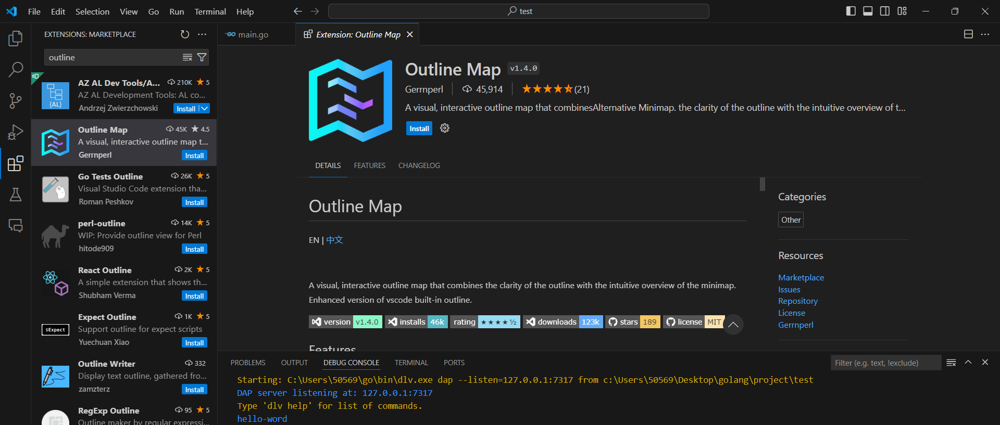

# 1 安装GO

## 1.1 安装GO运行环境

```
https://go.dev/
https://golang.google.cn/
```


### 1.1.1 基础知识扫盲

```bash
#win有两个版本msi版本不需要修改PATH路径
命令行输入go:
	在当前OS环境中查找命令（可执行文件），但目录太多不方便使用，所以依赖于PATH指定的路径。操作系统会去PATH指定的所有目录找go，找不到报错。windows优先再当前目录，找不到才去找PATH。

环境变量: 操作系统运行环境中提前定义好的变量
	PATH：如果你在命令行输入一端字符，shell解析它，被解释为可执行的文件（命令）：
	GOROOT: GO的安装路径
	GOPATH: 当前用户家目录 $HOME/go (第三方包安装路径)
	PATH: %USERPROFILE%/go/bin = GOPATH + bin = /root/go/bin
		win中的%USERPROFILE% = 家目录
		bin = binary 二进制/编译完成的可执行文件
		GOROOT + bin
	pkg目录:缓存第三方包文件bin日录:第三方包通过go install命令下载并编译好的可执行文件的存放
	go install命令:下载第三方包到$GOPATH/go/下面的缓存包文件们到该目录，编译好可执行文件放到$GOPATH/go/bin
	go get命令:下载第三方包到$GOPATH/g0/下面的缓存包文件们到该目录，以后编程用这些包


#查看win变量
win + r -- cmd -- 输入set

Path=C:\Program Files\Java\jdk1.8.0_281\bin;C:\Program Files (x86)\Common Files\Oracle\Java\javapath;C:\Program Files\Java\jdk-1.8\bin;D:\VM17.0\bin\;C:\Program Files (x86)\Common Files\Intel\Shared Libraries\redist\intel64\compiler;C:\Windows\system32;C:\Windows;C:\Windows\System32\Wbem;C:\Windows\System32\WindowsPowerShell\v1.0\;C:\Windows\System32\OpenSSH\;C:\Program Files (x86)\NVIDIA Corporation\PhysX\Common;C:\Program Files\NVIDIA Corporation\NVIDIA NvDLISR;C:\WINDOWS\system32;C:\WINDOWS;C:\WINDOWS\System32\Wbem;C:\WINDOWS\System32\WindowsPowerShell\v1.0\;C:\WINDOWS\System32\OpenSSH\;C:\Program Files\dotnet\;D:\XshellXftp\Xshell\;D:\XshellXftp\Xftp\;E:\Xmanager\;C:\Users\50569\AppData\Local\Programs\Python\Python311\Scripts\;C:\Users\50569\AppData\Local\Programs\Python\Python311\;C:\Users\50569\AppData\Local\Microsoft\WindowsApps;;D:\Pycharm\PyCharm Community Edition 2023.2.1\bin;;E:\vscode\Microsoft VS Code\bin
```


#### 1.1.1.1 通用添加环境变量mac/linux

```bash
#默认
GOPROXY缺省是https://proxy.golang.org,direct
#go1.16之后不用配置
go env -w GO111MODULE=On
#Go Module代理加速仓库服务
go env -w GOPROXY=https://mirrors.aliyun.com/goproxy/

#验证
go env 
```


### 1.1.2 win安装 

#### 1.1.2.1 配置PATH路径

```bash
#使用msi版本的安装方法会自动配置PATH --> 下载包 --> 然后解压到指定的目录
此电脑--右击--高级系统设置
```


**一个是当前用户PATH/一个是全局PATH**


#### 1.1.2.1 windows配置方法


### 1.1.3 linux安装

#### 1.1.3.1 解包

```bash
wget https://dl.google.com/go/go1.22.2.linux-amd64.tar.gz
tar xvf go1.22.2.linux-amd64.tar.gz -C /usr/local
```

#### 1.1.3.2 设置环境变量

```bash
export PATH:$PATH:/usr/loacl/go/bin/
export GOPROXY=https://mirrors.aliyun.com/goproxy/
export GOROOT=<go安装路径>
export GOPATH=$HOME/go
export PATH=$PATH:$GOROOT/bin/  	 #go程序在这里
export PATH=$PATH:$GOPATH/go/bin/	 #三方依赖默认存在这里
#验证
go env 
go version
```


#### 1.1.3.3 设置环境变量 七牛云

```
Go 1.13 及以上（推荐）

打开你的终端并执行

$ go env -w GO111MODULE=on
$ go env -w GOPROXY=https://goproxy.cn,direct
完成。

macOS 或 Linux

打开你的终端并执行

$ export GO111MODULE=on
$ export GOPROXY=https://goproxy.cn
或者

$ echo "export GO111MODULE=on" >> ~/.profile
$ echo "export GOPROXY=https://goproxy.cn" >> ~/.profile
$ source ~/.profile
完成。

Windows

打开你的 PowerShell 并执行

C:\> $env:GO111MODULE = "on"
C:\> $env:GOPROXY = "https://goproxy.cn"
或者

1. 打开“开始”并搜索“env”
2. 选择“编辑系统环境变量”
3. 点击“环境变量…”按钮
4. 在“<你的用户名> 的用户变量”章节下（上半部分）
5. 点击“新建…”按钮
6. 选择“变量名”输入框并输入“GO111MODULE”
7. 选择“变量值”输入框并输入“on”
8. 点击“确定”按钮
9. 点击“新建…”按钮
10. 选择“变量名”输入框并输入“GOPROXY”
11. 选择“变量值”输入框并输入“https://goproxy.cn”
12. 点击“确定”按钮
```


## 1.2 安装GO开发环境

```c
商业：Goland
免费：VSCode（JS ES TS开发第一工具） go语言/伟哥推荐 
     https://code.visualstudio.com/Download
```

### 1.2.1 安装Vscode

无脑安装向导


#### 1.2.1.1 Vscod配置

```bash
#直接在扩展中搜索 go插件
```

新建项目（开发根目录）


```bash
#安装完go会自动弹出强依赖也要安装
install all = 调试编译开发全部安装
```


```
gopls和glv最重要一定要确保他俩安装成功
go install 第三方包下载到 GOPATH指定下目录下，编译好可执行文件放到GOPATH/go/bin/
	下载第三方包 -- 编译 
go get 
	直接下载到GOPATH指定下目录下，以后编程用这些
```


```bash
#vscode 命令行
ctrl + j
```


**如果下载失败尝试手动安装 或者更换GOPROXY的代理地址**

```bash
#官网地址
https://pkg.go.dev/golang.org/x/tools/gopls
go clean -modcache

#必须安装
go install -v github.com/go-delve/delve/cmd/dlv@latest
go install -v golang.org/x/tools/gopls@latest
#不是必须，代码语法检测
go install -v honnef.co/go/tools/cmd/staticcheck@latest
```

**安装完检查**


#### 1.2.1.2 hello-word

```go
package main

import "fmt"

func main() {
	fmt.Println("hello-word")
}

//运行
go run main.go

//调试Vscode  F5(自动保存+编译+调试)
如果按 F5 报错
//确保在项目的根目录 在TERMINAL输入 go mod init www.zed.org
Build Error: go build -o c:\Users\50569\Desktop\golang\project\test\__debug_bin3602295647.exe -gcflags all=-N -l .
go: go.mod file not found in current directory or any parent directory; see 'go help modules' (exit status 1)
```


会生成一个go mod文件


#### 优化配置


**安装插件** 

outline map

提高代码阅读效率

curl + 左键




postfix 补全代码

