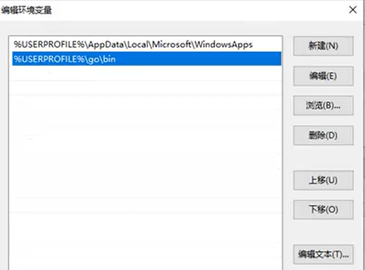
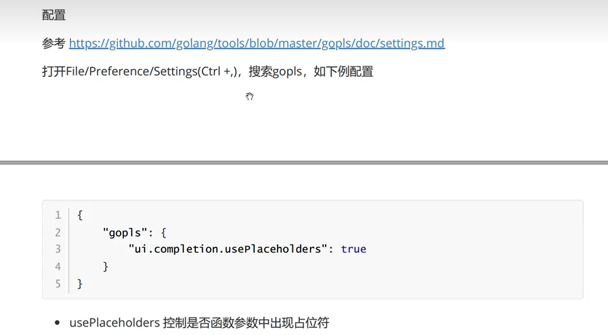
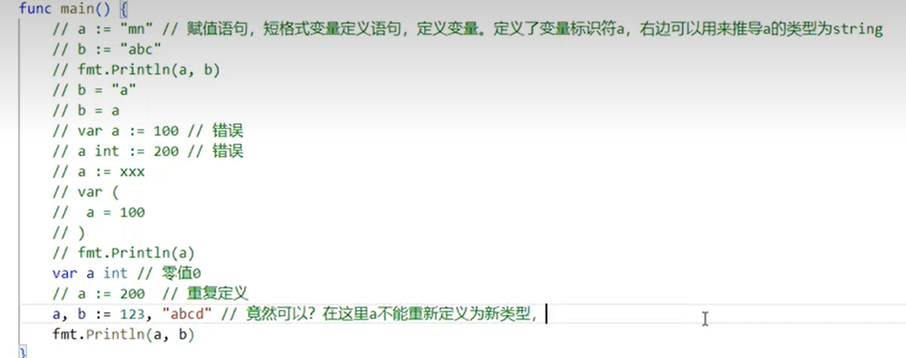
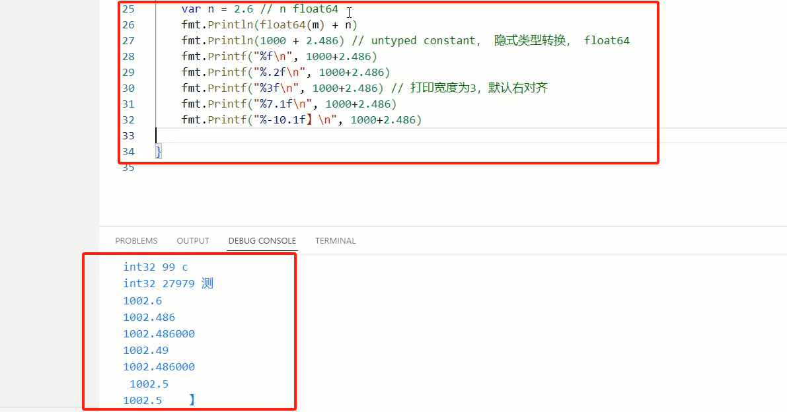
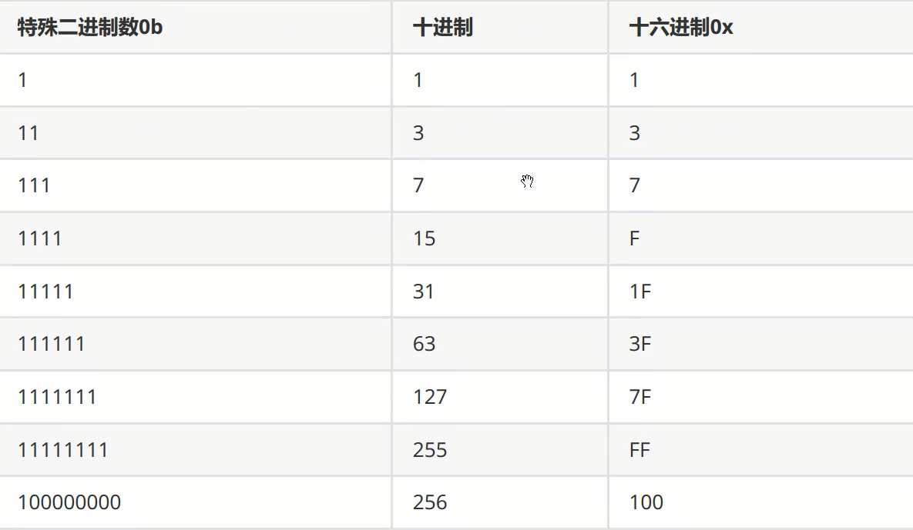
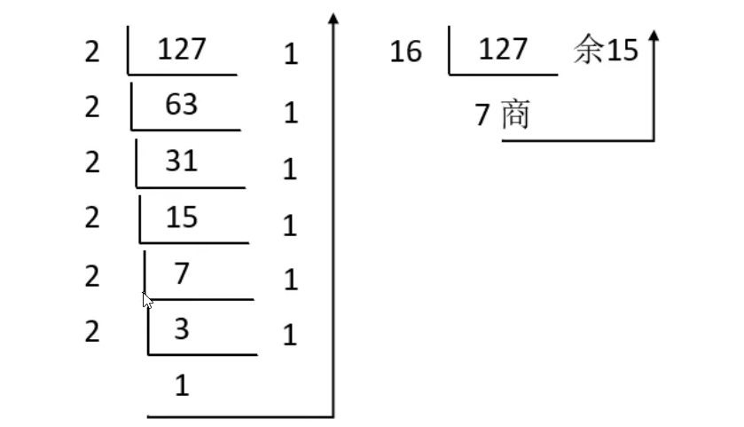

# 1 安装GO

## 1.1 安装GO运行环境

```
https://go.dev/
https://golang.google.cn/
```


### 1.1.1 基础知识扫盲

```bash
#win有两个版本msi版本不需要修改PATH路径
命令行输入go:
	在当前OS环境中查找命令（可执行文件），但目录太多不方便使用，所以依赖于PATH指定的路径。操作系统会去PATH指定的所有目录找go，找不到报错。windows优先再当前目录，找不到才去找PATH。

环境变量: 操作系统运行环境中提前定义好的变量
	PATH：如果你在命令行输入一端字符，shell解析它，被解释为可执行的文件（命令）：
	GOROOT: GO的安装路径
	GOPATH: 当前用户家目录 $HOME/go (第三方包安装路径)
	PATH: %USERPROFILE%/go/bin = GOPATH + bin = /root/go/bin
		win中的%USERPROFILE% = 家目录
		bin = binary 二进制/编译完成的可执行文件
		GOROOT + bin
	pkg目录:缓存第三方包文件bin日录:第三方包通过go install命令下载并编译好的可执行文件的存放
	go install命令:下载第三方包到$GOPATH/go/下面的缓存包文件们到该目录，编译好可执行文件放到$GOPATH/go/bin
	go get命令:下载第三方包到$GOPATH/g0/下面的缓存包文件们到该目录，以后编程用这些包


#查看win变量
win + r -- cmd -- 输入set

Path=C:\Program Files\Java\jdk1.8.0_281\bin;C:\Program Files (x86)\Common Files\Oracle\Java\javapath;C:\Program Files\Java\jdk-1.8\bin;D:\VM17.0\bin\;C:\Program Files (x86)\Common Files\Intel\Shared Libraries\redist\intel64\compiler;C:\Windows\system32;C:\Windows;C:\Windows\System32\Wbem;C:\Windows\System32\WindowsPowerShell\v1.0\;C:\Windows\System32\OpenSSH\;C:\Program Files (x86)\NVIDIA Corporation\PhysX\Common;C:\Program Files\NVIDIA Corporation\NVIDIA NvDLISR;C:\WINDOWS\system32;C:\WINDOWS;C:\WINDOWS\System32\Wbem;C:\WINDOWS\System32\WindowsPowerShell\v1.0\;C:\WINDOWS\System32\OpenSSH\;C:\Program Files\dotnet\;D:\XshellXftp\Xshell\;D:\XshellXftp\Xftp\;E:\Xmanager\;C:\Users\50569\AppData\Local\Programs\Python\Python311\Scripts\;C:\Users\50569\AppData\Local\Programs\Python\Python311\;C:\Users\50569\AppData\Local\Microsoft\WindowsApps;;D:\Pycharm\PyCharm Community Edition 2023.2.1\bin;;E:\vscode\Microsoft VS Code\bin
```


#### 1.1.1.1 通用添加环境变量mac/linux

```bash
#默认
GOPROXY缺省是https://proxy.golang.org,direct
#go1.16之后不用配置
go env -w GO111MODULE=On
#Go Module代理加速仓库服务
go env -w GOPROXY=https://mirrors.aliyun.com/goproxy/

#验证
go env 
```


### 1.1.2 win安装 

#### 1.1.2.1 配置PATH路径

```bash
#使用msi版本的安装方法会自动配置PATH --> 下载包 --> 然后解压到指定的目录
此电脑--右击--高级系统设置
```


**一个是当前用户PATH/一个是全局PATH**





#### 1.1.2.1 windows配置方法


### 1.1.3 linux安装

#### 1.1.3.1 解包

```bash
wget https://dl.google.com/go/go1.22.2.linux-amd64.tar.gz
tar xvf go1.22.2.linux-amd64.tar.gz -C /usr/local
```

#### 1.1.3.2 设置环境变量

```bash
export PATH:$PATH:/usr/loacl/go/bin/
export GOPROXY=https://mirrors.aliyun.com/goproxy/
export GOROOT=<go安装路径>
export GOPATH=$HOME/go
export PATH=$PATH:$GOROOT/bin/  	 #go程序在这里
export PATH=$PATH:$GOPATH/go/bin/	 #三方依赖默认存在这里
#验证
go env 
go version
```


#### 1.1.3.3 设置环境变量 七牛云

```
Go 1.13 及以上（推荐）

打开你的终端并执行

$ go env -w GO111MODULE=on
$ go env -w GOPROXY=https://goproxy.cn,direct
完成。

macOS 或 Linux

打开你的终端并执行

$ export GO111MODULE=on
$ export GOPROXY=https://goproxy.cn
或者

$ echo "export GO111MODULE=on" >> ~/.profile
$ echo "export GOPROXY=https://goproxy.cn" >> ~/.profile
$ source ~/.profile
完成。

Windows

打开你的 PowerShell 并执行

C:\> $env:GO111MODULE = "on"
C:\> $env:GOPROXY = "https://goproxy.cn"
或者

1. 打开“开始”并搜索“env”
2. 选择“编辑系统环境变量”
3. 点击“环境变量…”按钮
4. 在“<你的用户名> 的用户变量”章节下（上半部分）
5. 点击“新建…”按钮
6. 选择“变量名”输入框并输入“GO111MODULE”
7. 选择“变量值”输入框并输入“on”
8. 点击“确定”按钮
9. 点击“新建…”按钮
10. 选择“变量名”输入框并输入“GOPROXY”
11. 选择“变量值”输入框并输入“https://goproxy.cn”
12. 点击“确定”按钮
```


## 1.2 安装GO开发环境

```c
商业：Goland
免费：VSCode（JS ES TS开发第一工具） go语言/伟哥推荐 
     https://code.visualstudio.com/Download
```

### 1.2.1 安装Vscode

无脑安装向导


#### 1.2.1.1 Vscod配置

```bash
#直接在扩展中搜索 go插件
```

新建项目（开发根目录）


```bash
#安装完go会自动弹出强依赖也要安装
install all = 调试编译开发全部安装
```


```
gopls和glv最重要一定要确保他俩安装成功
go install 第三方包下载到 GOPATH指定下目录下，编译好可执行文件放到GOPATH/go/bin/
	下载第三方包 -- 编译 
go get 
	直接下载到GOPATH指定下目录下，以后编程用这些
```


```bash
#vscode 命令行
ctrl + j
```


**如果下载失败尝试手动安装 或者更换GOPROXY的代理地址**

```bash
#官网地址
https://pkg.go.dev/golang.org/x/tools/gopls
go clean -modcache

#必须安装
go install -v github.com/go-delve/delve/cmd/dlv@latest
go install -v golang.org/x/tools/gopls@latest
#不是必须，代码语法检测
go install -v honnef.co/go/tools/cmd/staticcheck@latest
```

**安装完检查**


#### 1.2.1.2 hello-word

```go
package main

import "fmt"

func main() {
	fmt.Println("hello-word")
}

//运行
go run main.go

//调试Vscode  F5(自动保存+编译+调试)
如果按 F5 报错
//确保在项目的根目录 在TERMINAL输入 go mod init www.zed.org
Build Error: go build -o c:\Users\50569\Desktop\golang\project\test\__debug_bin3602295647.exe -gcflags all=-N -l .
go: go.mod file not found in current directory or any parent directory; see 'go help modules' (exit status 1)
```


会生成一个go mod文件


#### 优化配置




**安装插件** 

outline map

提高代码阅读效率

curl + 左键


postfix 补全代码


# 2 初识GO语言

## 2.1 GO命令

```go
go install  //下载第三方包到$GOPATH/g0/下面的缓存包文件们到该目录，编译好可执行文件放到$GOPATH/go/bin
go get 		//下载第三方包到SGOPATH/go下面的缓存包文件们到该目录，以后编程用这些包。如果开启了go模块，包依赖记录在go.mod中
	-u 更新包
go mod		//包管理
	go mod init <name>
	go mod tidy   //扫描当前项目，把go.mod文件中不依赖的第三方包删除，也可以把依赖的第三方包加入

go env
go version
go build 	 //编译
	-o 指定文件
go run		 //编译+运行

fmt 自动格式化代码  gols自动支持
```


## 2.2 项目结构

官方没有提供布局方案


## 2.3 计算机基础


```
冯诺依曼体系五大部件
	CPU:
	运算器
		一般给的一个任务，cpu要花几个震荡周期完成。主频越高越好
		假设3个滴答完成一次计算，请问频率高、低哪个省时间?主频越高越好，但是频率有天花板，所以上多核
	控制器
总线Bus：数据总线、控制总线 
存储器Memory:内存，掉电丢失，速度快
	运行内存:掉电丢失的芯片
	内部存储内存:相当于掉电不丢失的硬盘
	线性编地： 类似于门牌号对应一个内存地址 102 103 看下图
	
	
输入设备Input:数据输入
输出设备output:
输入输出设备不能和CPU直接打交道，CPU必须通过和内存交互进行数据交换。因为cpu中没有大量存储的空间。
	寄存器：为了本次计算所需数据服务
	缓存：cache（为了加速计算，预读取指令）Mb
	CPU亲缘性 避免CPU切换无法充分利用缓存
		1、2KB、3多核共享缓存
显卡：数字信号输入给显卡，显卡输出到显示器 
主板：骨架、神经系统

芯片组：
时钟振荡器
	脉冲信号，触发数字电路工作，频率越快CPU越快
	所有的数字设备都要利用产生的脉冲信号工作
	CPU运行频率是最高的3.xGhz
	
运行速度
CPU -- 内存（TB） 
IO设备，相对内存很漫 硬盘(PB)  固态 相对内存都特别慢

内存快但是掉电丢失 成本高
硬盘慢，但是可以持久化数据

除非有必要尽量在内存中读写，可以提高性能

程序向CPU发送指令  CPU找内存要数据 把需要的数据提前加载的内存中的cache中
```


**CPU并不直接从速度很慢的I0设备上直接读取数据，CPU可以从较慢的内存中读取数据到CPU的寄存器上运算器**
CPU计算的结果也会写入到内存，而不是写入到I0设备上


强类型语言

必须编译


弱类型  python  shell

强类型  C GO java

- 数据声明必须指定明确类型

- 不支持隐式类型转换，类型转换必须强制

- 代码编译成本地可执行代码

- 不需要虚拟机来运行
- 支持垃圾回收

### 不会写作业，刚开始，不要看答案，不会写，用中文写思想逻辑


# 3 GO基础语法

## 3.1 注释

```go
// 多行注释
/*
	a
	b
	a b c
*/


// TODO： 未完成任务
// NOTE： 请注意
// Deprecated： 告诉别人已经废弃了
// 一行一句代码

package main

import "fmt"

func main() {
	fmt.Println("lixijun")
	// TODO 未完成
}

```


## 3.2 命名规范

```bash
#大驼峰 如果要在包内外可见，就采用大驼峰命名
UserName
#小驼峰 如果只在包内可用，就采用小驼峰命名
userName
#sank
user_name

#条件变量、循环变量可以是单个字母或单个单词，Go倾向于使用单个字母。Go建议使用重短小

#常量用驼峰
在其他语言中，常量多使用全大写加下划线的命名方式，Go语言没有这个要求
对约定俗成的全大写，例如PI

函数/方法的参数、返回值应是单个单词或单个字母、函数可以是多个单词命名、类型可以是多个单词命名

方法由于调用时会绑定类型，所以可以考虑使用单个单词
包以小写单个单词命名包名应该和导入路径的最后一段路径保持一致
接口优先采用单个单词命名一般加er后缀。Go语言推荐尽量定义小接口，接口也可以组合
```


## 3.3 关键字

```bash
https:/lgolang.google.cn/ref/spec
#不能乱改
```

Go自己要用的

| 序号 | 关键字        | 说明                                                 |
| ---- | ------------- | ---------------------------------------------------- |
| 1    | `break`       | 用于终止最近的 `for` 或 `switch` 语句。              |
| 2    | `case`        | 用于定义 `switch` 语句的一个分支。                   |
| 3    | `chan`        | 用于声明通道，通道是一种允许并发程序之间通信的类型。 |
| 4    | `const`       | 用于声明常量。                                       |
| 5    | `continue`    | 跳过当前循环的剩余代码，直接开始下一次循环。         |
| 6    | `default`     | 用于定义 `switch` 语句中的默认分支。                 |
| 7    | `defer`       | 用于安排一个函数在调用它的函数退出前执行。           |
| 8    | `else`        | 用于定义 `if` 语句的“否则”分支。                     |
| 9    | `fallthrough` | 用于 `switch` 语句中，表示继续执行下一个 `case`。    |
| 10   | `for`         | 用于创建循环。                                       |
| 11   | `func`        | 用于声明函数。                                       |
| 12   | `go`          | 用于启动一个新的并发线程，称为 goroutine。           |
| 13   | `goto`        | 跳转到程序中的指定行。                               |
| 14   | `if`          | 用于执行条件判断。                                   |
| 15   | `import`      | 用于导入其他包。                                     |
| 16   | `interface`   | 用于定义接口。                                       |
| 17   | `map`         | 用于声明映射类型。                                   |
| 18   | `package`     | 用于定义包。                                         |
| 19   | `range`       | 用于迭代数组、切片、映射和通道。                     |
| 20   | `return`      | 用于从函数返回。                                     |
| 21   | `select`      | 用于创建多个通道操作的并发形式。                     |
| 22   | `struct`      | 用于定义结构体。                                     |
| 23   | `switch`      | 用于执行多个 `case` 的条件分支选择。                 |
| 24   | `type`        | 用于定义类型。                                       |
| 25   | `var`         | 用于声明变量。                                       |


## 3.4 预定义标识符

```bash
https://golang.google.cn/ref/spec#Predeclared identifiers
#可以但别
```


| 标识符       | 说明                                                 |
| ------------ | ---------------------------------------------------- |
| `bool`       | 布尔类型，表示真或假。                               |
| `byte`       | 8位的整数，代表一个ASCII码。                         |
| `complex64`  | 复数类型，由两个32位浮点数表示实部和虚部。           |
| `complex128` | 复数类型，由两个64位浮点数表示实部和虚部。           |
| `error`      | 错误类型，用于错误处理。                             |
| `float32`    | 32位浮点数。                                         |
| `float64`    | 64位浮点数。                                         |
| `int`        | 普通整数，大小取决于运行环境的架构（32位或64位）。   |
| `int8`       | 8位整数。                                            |
| `int16`      | 16位整数。                                           |
| `int32`      | 32位整数。                                           |
| `int64`      | 64位整数。                                           |
| `rune`       | 代表一个Unicode码点的整数类型。                      |
| `string`     | 字符串类型，由一系列字节组成。                       |
| `uint`       | 无符号整数，大小取决于运行环境的架构（32位或64位）。 |
| `uint8`      | 8位无符号整数。                                      |
| `uint16`     | 16位无符号整数。                                     |
| `uint32`     | 32位无符号整数。                                     |
| `uint64`     | 64位无符号整数。                                     |
| `uintptr`    | 无符号整数，用于存储指针的二进制表示。               |


## 3.5 内置函数

| 标识符    | 说明                                 |
| --------- | ------------------------------------ |
| `make`    | 用于创建切片、映射和通道。           |
| `new`     | 用于分配一个类型的新实例。           |
| `len`     | 获取字符串、切片、映射或通道的长度。 |
| `cap`     | 获取切片或通道的容量。               |
| `append`  | 用于追加元素到切片。                 |
| `copy`    | 用于复制切片内容。                   |
| `close`   | 关闭一个通道。                       |
| `complex` | 创建一个复数。                       |
| `real`    | 返回复数的实部。                     |
| `imag`    | 返回复数的虚部。                     |
| `panic`   | 触发一个运行时恐慌。                 |
| `recover` | 用于从恐慌中恢复。                   |


## 3.6 标识符

- 一个名字，本质上是个字符串，用来指代一个值
- 只能是大小写字母、数字、下划线，也可以是Unicode字符
- 不能以数字开头
- 不能是Go语言的关键字
- 尽量不要使用“预定义标识符"，否则后果难料
- 大小写敏感

**建议**

不要使用中文非必要不要使用拼音，尽量遵守上面的命名规范，或形成一套行之有效的命名规则。


```bash
#什么是标识符
a = 100  a指代100, a就是就是代表100的名称，a = 100 的标识符
100是数字，常量，不可变的值  字面常量
100+1=101，100还是那个100，1还是那个1，101就是101
并没有修改 100 也没有修改1 而是出现了一个新的值

 100 + 1  100 + 2 100 + 3 替换成  a + 1  a + 2  a + 3 


如果
a = 200 说明a背后指代的值可以变化（a变了）；所以可以变化的指代值的标识符，称为变量标识符
如果说a的指代一旦关联，不可变，a这个标识符指代的值不能改变了，称为常量标识符
```


## 3.7 字面常量

它是值，不是标识符，但本身就是常量，不能被修改。

Go语言中，boolean、rune、integer、float、complex、string都是字面常量。其中，rune（int32）、integer、flaat、complex常量被称为数值常量。

```
数字1就是1，数字100就是100，两个加起来=101 但是来的1 和 100 并没有改变


"ab" + "c" = "abc"  ab还是以前的ab，c也是c 得出一个新的值是 abc (字符串类型)

‘ab’  ‘c’  （字符类型）只能放一个字符

true false iota

var 变量名
const常量名= 初值 常量必须在定义是直接赋初值

const c ="abc“
const d int = 100 //字面常量100关联
const e uint8 = 100 // 右边无类型常量100 ，和左边有类型常量uint8e关联
// int 8bits -- 1bytes -128~127 -- 0~255

const d  = ”100“ // 类型推导 根据右边推断左边
const d  = 100   // 默认推导为 int   int 和 uint8两码事

如果左边没有指定类型，会根据右边的默认类型推导出他的类型。
字面常量本身是有类型的，
```

以上字面常量在Go中也被称为无类型常量untyped constant.无类型常量的缺省类型为bool、rune、int、float64、complex128或字符串,

注意:Go语言的常量定义，必须是能在编译器就要完全确定其值，所以，值只能使用字面常量。这和其他语言不同!例如，在其他语言中，可以用常量标识符定义一个数组，因为常量标识符保证数组地址不变，而其内元素可以变化。但是Go根本不允许这样做。


```go
在go语言中值有类型之分 
	无类型常量untyped constant
		无类型并不不是真的没有，而是有默认值；
		const a int = 101 // 正常写法
		const(   		  // 推导写法，根据右边数值的缺省类型推导出左边标识符的类型
			b = "abc"
			c = 100
		)

const a = "abc" 赋值语句
// 右边是无类型常量，它的缺省类型是string，左边a没有指定类型，a会进行类型推导，会依赖右边的类型，所以a被推测为string类型
```


## 3.8 iota

```
iota 批量定义常量
是从成批的第一个常量开始计数
```


范例：

```go
// 单独iota 从0开始
const a = iota	// 0 
const b = iota	// 0 
```


```go
// 批量定义
const (
	SUN = iota // 0
	MON = iota // 1
	TUE = iota // 2	
)

const (
	SUN = iota // 0
	MON
	TUE
)

const(
	a = iota // 0
	b 		// 1
    c		// 2
    _		// 按道理是3，但是丢弃了
    d		// 4
    e = 10  // 10
    f		// 10
    g = iota// 7
    h		// 8

)


const(
	m = 0          // iota = 0 * 2
    n			   // iota = 1 * 2
    a = 2 * iota   // iota = 2 * 2
    b			   // iota = 3 * 2
    c        	   // iota = 4 * 2
    d			   // iota = 5 * 2
)

a b c d 分别是 4 6 8 10
```


```bash
其他语言
const a = [1,2]

在go语言中，常量不可以定义数组
var a = [3]int{100,200,300}  // 代表定义变量 指定数组中有三个元素，而且必须是int类型

const a = [2]int{100,200}  报错
{}可以在花括号写元素
Go语言的常量定义，必须是能在编译器就要完全确定其值，所以，值只能使用字面常量。(必须给定值而且不能变)
但是数组的值可以更换，违背了const，所以在go中只能定义为var

其他语言是按照开头只要开头指向的内存地址不变那么就可以定义为常量

```


## 3.9 常量

```
cpu要使用的数值都要放在内存里面，因为磁盘太慢了。
“abc” 可以直接使用，但是如果是100个字符每次都用手敲很麻烦，所以我们可以给100个字符 起一个名字标识符
a = "100个字符" 后续使用我们用a指代100个字符。
“100” 是我给定的值 是我写出来的值 = 字面常量
我给定的值 计算机拿去运算比如 a + 1 = 101  并不会改变我们原来a的值  而是诞生了一个新的值
我可以给 a 这个标识符赋值 让他代表 100 这个字面常量

如果a的指代可以变化=变量
如果a的指代不可以变化 = 常量 但也可能是a有类型要求，同类型可以再次赋值=变量


如果不可以
	a有类型要求，不可以改变类型，同类型可以再次赋值，
	a是变量a就是不可以再被赋值，a和第一个赋给它的值之间的联系不可改变，a称为常量标识符
	
	
在其他语言中
	const a = [11,22]
	const a = [11,22,33]
	const a = [1231]
	可以这样玩，因为a指向内存中的数组开头的地址没变
	
在GO语言中
	const a = [2]int{1,2}
	必须指定数组的长度，但数组中的值可以变，长度不能变，因此不能被定义为常量。
	数组好比是一个容器 里面可以存放多个元素，元素可以变。可变就不能定义为常量
```


定义：

```ABAP
常量:标识符的指向的值一旦建立，不可改变，要求定义是必须建立关联
变量:标识符的指向的值建立后，可以改变
	1类型也可以变，往往动态语言JS、Python，举例a=100，a="abc",a=[1,2,3]
	2只能同类型可变
```


## 3.10 变量


```go
func main(){
	var a = 100
		a = 200
}

func main(){
	var a  		// 错误 因为GO是强类型语言，需要定义类型，但右边没有字面常量，无法根据默认类型推导a的类型
	var a int   // 正确 虽然没有赋值但是给定了类型。 GO特性 零值可用
    const b int // 错误 常量没有零值可用
    var a = 100 // 重复定义 不可以
}


常量可以批量定义，因为他会继承上一个赋值语句，可以进行类型推导。
变量批量定义必须要指定类型，因为它可以为空，为空就不能推导，不能确定类型，就报错哦。

var a int , b int // 错误
var a,b int // 可以 如果要写在一行，必须同类型，并且在最后指定类型
var a,b int = 100,200 //正确 要一起赋值
var(
	a int 
    b int 
)
```


### 3.10.1 短格式变量

```go
func main(){
	a := 100 // 短格式 变量定义 = 定义了变量标识符a 右边可以推导出类型 a 的类型
    a,b，c := 100,"avc".'d'// 短格式批量定义，依次对应推导   定义 赋值 推导
    
    a,b = b,c // 纯粹的赋值 没有类型推导  要注意类型，类型不同会报错
}

              	      // 短格式只能写在func中，不能再全局中定义 //


package main
func main() {
	var a,b = 100,200
	a:=123     // 这样显示重复定义
	c,d := 300,400
	var t = "lxj"
	t,f := "aolgei",123 // 这样就忽略了重复赋值，但类型必须一样，go给自己挖坑了属于是
	println(a,b)
	println(c,d,t,f)
}


// 定义 + 赋值
var a int = 100
// 定义 + 赋值 + 类型推导
	b := 200
// 存粹的赋值
	c = b


// 交换赋值
package main
import "fmt"

func main() {
	var a,b int = 100,200
	c,d := 123,456
	a,b = c,d  // 类型不匹配无法交换
	fmt.Println(a,b,c,d)
	var (
	 m = 1
	 n = 2
	)
	m,n = n,m // 赋值语句 = 从右往左执行，右边先定格
	2 1   2 1
	fmt.Println(m,n)

	// 其他语言交换变量
	tmp := m        
	 1
	m = n 
	2
	n = tmp 
	1
}

```




**注意：**

```
变量的定义赋值 从右往左边，右边的值先定下来，依次给左边赋值

如下：
	m = 111 
	n = 222
	
	m,n = n , m 
222,111 < 222 , 111
最后：
	m = 222
	n = 111
	
	
var a,_,c = 1 2 3 int 
	blank 黑洞 只能在左边写
	空白标识符
```


```ABAP
标识符写代码时候，用来指代某个值的。编译后还有变量、常量标识符吗?
没有了，因为数据在内存中，内存访问靠什么?地址，标识符编译后就没有了就换成了地址了

源代码本质是文本文件
编译，源代码编程成二进制可执行文件
运行这个磁盘上的二进制可执行文件，运行在当前0s上，变成进程，进程要不要占内存空问?要的吗?变量、常量、值在这块内存中放着
```


**包内包外**

```go
// 同一个目录下只能有一个包
main  函数叫做入口函数

// 包内可见 不同文件用同一个包 我在B文件顶一个 var b = "abc" （全局变量，包内可见） 我在A文件调用这个包虽然没有定义也可以使用B定义变量；
var ABC = 100  // 全局包外可见/包内也可以

使用 imoprt 导入的包 如果是包外可见 就可以用 如果是小写就不能用
使用package 使用同一个包 即使不在同一个文件中定义过也可以跨文件调用。同一个包内不同的go文件可以互相访问变量，但是就近原则

全局不能用短格式
```


# 4 类型

## 4.1 布尔型

```go
// bool在go中不是int类型，也不是其他整数类型。在go中，boo1就是布尔型，和整型没有关系，就是完全不同的类型。
true false 字面常量 = bool
```


## 4.2 数值型

复数：complex64 complex128

### 4.2.1 整型

- 长度不同:int8、int16(C语言short)、int32、int64(C语言long)  可以描述负数因为可以带符号
  - 最高位是符号位
  - rune类型本质上就是int32

- 长度不同无符号:uint8、unit16、uint32、uint64 不可以描述负数 因为是无符号

  u即unsigned，最高位不是符号位

  - ​	byte类型，它是uint8的别名

- 自动匹配平台:int、uint  

  int类型它至少占用32位，但一定注等同于int32，不是int32的别名。要看CPU，32位就是4字节，64位就是8字节。但是，也不是说int是8字节64位，就等同于int64，它们依然是**不同类型**

虽然他们都是整型这一类，但他根本上完全不同的类型，go语言对类型极其敏感，不能互操作。


**扩展知识**

```
计算机世界这有二进制数据，每一个位bit表示0或者1，最多表达2种可能性
unsigned = 无符号 以int8 和 uint8 举例：
8bits，总共能够表达256种状态
	int8 -- 1byte -- 8bits 标识正负数将最高位留出来不表示数据状态，用0表示正数 用1表示负数，剩余7bit标识数字
		7bits，总共能够表达256种状态 -128-128
		表示 十进制2
		0 0000010
		表示 十进制-2
		1 0000010
		但计算机中实际上是补码（符合位不动，其余位按照位取反，最后加1）
		1 1111101 取反
		1 1111101  +1
		1 1111110
补码：把减法当作加法，在计算机中所有减法都变成加法，5 - 4 = 1 怎么来的 5 + （-4）= 1 
uint8 -- 1byte -- 8bits 不能标识负数，所有位都用来标识数字
	8bits，总共能够表达256种状态只能标识正数
	十进制2
	00000010
```

 


### 4.2.2 类型

示例：

```go
func main(){
	var m int64 = 50
	fmt.printf("%T %d\n",m,m)
	fmt.printf("%+v\n",string(m))
    fmt.printf("%s\n",string(m))
    fmt.printf("%T %d\n",rune(m))  //rune tyep = int32 
    fmt.printf("%T %d\n",rune(m),rune(m)) // 占位符，每位在右边写，很繁琐
    fmt.printf("%T %[1]d\n",rune(m)) // 整个函数括号中的值是一个数组，有索引（下标）元素已逗号分割，也就是一个逗号一个值对应一个索引。
    
    fmt.printf("%[1]T %[3]d %[2]d %d\n",100，200，300，400) // 最后一个%d的值是什么
    // 最后一个%d值300，前面占位符指定是某个索引，它的值就是索引对应的元素。
    // 如果下一个占位符没有给定索引，那么它的值将根据上一个 %[index]d + 1,来推导出当前占位符的值   
}
// 通过强制类型转换，打印出来，并不是字符"50"，而是“2”。
// go语言会把string中的数值，看作为ascii或unicode码，所有go语言回去查编码表。
```

实例：


**格式输出**

```go
fmt.Println Print line 输出到控制台并换行
fmt.Printf("%T %T %T %T \n",a,b,c,a + b + c)  // format
Printf 在控制台打印 f是format
%T 占位符 和后面的值依次对应
T 表示type，取值的类型

%d digital 数值型，往往用于整数形
%s 用打印string类型的值
%q 带引号的字符串%s
%c character 字符输出
%f float 浮点数输出，默认精度.000000
%.2f 表示小数点后两位
%3f 表示宽度 即打印宽度 右对齐

fmt.Printf("%[2]T %[1]d\n", rune(m), string(m)) 值从1开始编
%[indes]，从1开始编号，下一个如果没有指定索引，索引默认是index+1 注意：溢出

type rune = init32  类型别名rune  他是4tytes或32bits int
type myint int32  // 这不是别名 这里没有 =  这里的意思是 我基于int32 新定义了一个新的类型 myint  在go中只要是不同的类型就是不同的
type 可以定类型

type B = int32 // 类型别名，B和int32就是同一种类型的不同名字B、rune(go内建的)、int32是一个类型的不同名称罢了
	var a B = 10 
	var a rune = 10 
```


```go
package main

import "fmt"

func main() {
	var k = 100
	w := 100
	var r int = 100
	fmt.Printf("%T %T %T %T\n", k, w, r, k+w+r)
	var m int64 = 999
	fmt.Printf("%T %d \n",m,m)
	// fmt.Printf(k+w+r+m) // 不可以加 因为go语言是强类型  int 和 int64 根本不是同类型
	fmt.Println(k+w+r+int(m)) // 强制类型转换，可能会失败
}
```

**强制类型转换:**把一个值从一个个类型强制转换到另一种类型，有可能转换失败。

 **与其他语言不同，即使同是整型这个大类中，在Go中，也不能跨类型计算、如有必要，请强制类型转换**


示例：

```go
package main
import "fmt"

func main() {
	var k = 100
	w := 100
	var r int = 100
	fmt.Printf("%T %T %T %T\n", k, w, r, k+w+r)
	var m int64 = 999
	fmt.Printf("%T %d \n", m, m)
	// fmt.Printf(k+w+r+m) // 不可以加 因为go语言是强类型  int 和 int64 根本不是同类型
	fmt.Println(k + w + r + int(m))         // 强制类型转换，
	fmt.Printf("%+v\n", string(m))          // 数值可以转成字符串 ϧ ，（ascli或unicode码）
	fmt.Printf("%T %d\n", rune(m), rune(m)) // rune = int32  4bits 32bytes
	fmt.Printf("%[1]T %[1]d\n", rune(m))    // 格式化左边可以写右边的索引，默认右边第一个数值索引是1
	fmt.Printf("%[2]T %[1]d\n", rune(m), string(m))
	fmt.Printf("%d,%d;%d.%d]\n", 100, 200, 300, 400)          // 100,200;300.400]  左边只替换%d占位符
	fmt.Printf("%[1]d %[3]d %[2]d %d \n", 100, 200, 300, 400) // 错误 100 300 200 400 正确 100 300 200 300 如果当前没有给定索引，就按照上一个索引的值+1算出当前的索引
	fmt.Printf("%[1]d %d %[2]d %d \n", 100, 200, 300, 400)    // 100 200 200 300
}
```


##### **类型别名**

```go
package main
import "fmt"

func main() {
//	var a = 100
//	var b int64 = 200
//	var c rune = 300 // type rune = init32  类型别名rune  他是4tytes或32bits int

	//这两个的意思完全不同
	type B = int32    B 指代 int32   B可以和int32类的值互操作      类型别名
	type x int32	  我创建了一个型类型X 他的类型是int32新的类型	重新定义 虽然你的本质也是int32 但是你是新的类型
	
	type x int32
	type B = int32 
	var G B = 100
	var m x = 111
//	fmt.Println(G + m)    因为G的类型是B B是int32 m的类型是x x类是也是int32 但是x是新定义的类型 不能直接计算
fmt.Println(G + int32(m)) 强制类型转换
}

```

##### **二刷**

```go
// 类型别名，rune的类型 = int32，别名就是rune代表int32。不是型类型，可以互相操作。
type rune = int32
// 定义新类型zedint，它的类型是int32，不是别名。
type zedint int32 

虽然本质int32，但 rune 和 zedint 不是相同的类型，zedint是基于int32定义的新类型

type A int32
type B = int32

var c B = 100
var d rune = 200
fmt.println( c + d ) // 可以相加，因为B是int32的别名，rune也是int32的别名。类型一样可以相加。
var m A = 1000
fmt.println( c + m ) // 不能相加，因为c的类型是B，B是int32的别名，而m是A类型，A != int32
fmt.println( c + int32(m) ) // 类型转换
```


### 4.2.3 字符和整数

```go
package main
import "fmt"

func main() {a
	var a = '测'
	fmt.Printf("%T %[1]d\n",a)   
}
打印：int32 27979（10进值）

fmt.Printf("%T %[1]d %[1]c\n",a)
// '测' 单引号在GO中默认是rune类型 rune类型是 int32 的别名
// '测' 是字面表达，实际上最终存在计算机中是数字，这是一种方便我们书写代码的格式化，实际上程序会自动转换成数字。
// %d解释为整数，%c解释为字符。内存中一个数据，看你赋子它什么类型，就可以看到不同的东西。

rune 类型保存的是字符，字符的unicode码。
重新赋值，不是重新定义，不会改变类型
```

示例：

```go
var a = '测'
	a = 'abc' // 错误，字符只能是单个，多个就要定义为“abc”
	a = 'c'   // 正确，重新赋值，a的类型是什么type rune = int32，重新赋值类型不变。不是重新定义
fmt.printf("%T %[1]d %[1]c\n",c)
			int32  99   c
	a = 99 	  //  这里不同于定义变量时，不会使用类型推导，而是给a重新赋值为99。千万不能理解成99是int缺省类型。在定义变量时，没指定才会用缺省。这里a 已经时rune类型，而rune就是int32，int32可以定义99整数呀。			*****涉及到隐式类型转换，请看下一小节*****
fmt.printf("%T %[1]d %[1]c\n",c)

	a = '0x63' // 不对，这是代表整数
    a = '\x63' // 正确，告诉Go语言'\x63'代表的是一个字符。虽然是一串数字，但是他代表一个字符

// 计算机本质都是数值，重点是如何解释，如果解释为数值那么就是数值。如果解释为字符，那么就去查ascii码表。
实例:
    func main(){
        var b = '测'
    fmt.printf("%T %[1]d %[1]c\n",b)
    int32 27979 测 
        b = 27979 // 隐式类型转换 b = int32(27979)
    fmt.printf("%T %[1]d %[1]c\n",b)
    int32 27979 测 
    }
```

##### 结论

```abap
可以认为Go语言中没有字符类型，本质上是int32的别名。习惯性称rune为字符型。所谓的字符型，也就是rune类型，说白了字符型就是整数。
```

##### 隐式类型转换

```GO
// 这两条赋值语句意义相同，语法糖（隐式类型转换），提高开发效率。
var a int32 = 100 // 隐式类型转换
var a int32 = int32(100) // 如果等于号右边是untyped constant，会根据等于号左边的类型对等于号右边的类型，进行隐式类型转换。
	a = 99 // 什么意思？= 隐式类型转换
// 在上面已经确定变量标识符a的类型为int32，右边的99是字面常量缺省类型int。
// a = 99 重新赋值，而不是重新定义所以类型不变。
   a = int32(99)  等价于  a = 99

// 隐式类型转换只作用于 untyped constant
var z int32 = 10086
var x int64 = z // 报错，不可以因为z是int32，x是int64。需要手动进行类型转换
var x int64 = int64(z)
         n := z // 可以n没有指定类型，可以利用Z做类型推到。
```

##### 自动类型提升

```go
var m int32 = 100
		 n := 2.2
fmt.printf(n+m)		 	 // 不能相加，因为m类型是int32,n类型是float64。
fmt.printf(n+float64(m)) // 强制类型转换可以相加

fmt.printf(100+2.2)  // 可以相加，untyped constant的特权，有隐式类型转换
fmt.printf(float64(100) + 2.2) 

var x int = int('测')
var x int = '测' // 测 = int32 = 4byte = 27979 = unicode码 
var x  = ”测“    // string utf-8
```


### 4.2.4 浮点数

示例：

```go
	var m int32 = 100 // 左边类型int32 右边int 会做隐式类型转换等价于 m int32 = int32(100)
	var n = 2.6       // float64
	// fmt.Println(m+n) m 和 n 不能直接加因为类型不同
	fmt.Println(float64(m) + n)    // 强制类型转换
	fmt.Println(100 + 2.65)        // 可以加 因为untyped constant类型隐式类型转换 100是int 2.6是float 会把100提升为float64
	fmt.Printf("%f\n", 100+2.65)   // 默认 .000000
	fmt.Printf("%.2f\n", 100+2.65) // %.2f 小数点后两位
	fmt.Printf("%30f\n", 100+2.65) // %30f 宽度右对齐，30包括打印打字符多余的用空格补充，打印的数值会把宽度覆盖，如果宽度覆盖了打印的值，多余的用空格补。如果没覆盖则看不出。
	fmt.Printf("%-30f\n", 100+2.65)// %-30f宽度左对齐
	fmt.Printf("%30.1f\n", 100+2.65)// %-30.1f宽度左对齐并且只显示小数点后1位
```

图示：



示例：

```
var c rune = '中' // 字符用单引号。想一下，计算机中有中文吗？
fmt.printf("%T %c %d\n",c,c,c)
int32 测 27979

var c byte = '中' // 报错， '中 '= rune = int32 > 1 byte 
var m byte = 'a'  // 正确， a是ascii表，不超过 1 byte

var e rune = 27979
fmt.printf("%T %c %d\n",e,e,e)
int32 测 27979
```

```ABAP
字符串是由若干个字符组成，在内存中使用utf-8编码。而rune只能保存一个字符，输出是unicode。
```


### 4.2.5 进制转换

常见进制有二进制、八进制、十进制、十六进制。重点掌握二进制、十六进制。

十进制逢十进一;十六进制逢十六进一;二进制逢二进一

**什么是权**

```
"权" 指的是每个数位上的数值所代表的实际大小.由于在不同的数位上，相同的数字代表的实际值是不同的。
“权”的概念是为了帮助我们理解在不同进制数系统中，每个数位上的数字是如何转化为实际数值的。
```

**按位权算**

权的值 = 当前基数位置的幂次方 （第几位就几次方）

即每一位的数值乘以它所处位数的基数幂次。

**按位乘权求和**

```bash
当我用十进制表示数字的值时：每个数字在某个特定位置上的值，由其在该位置上的数值乘以该进制基数的位置次幂
第一位（从右向左）通常代表的是0次方，第二位代表的是1次方。（千3 百2 十1 个0）
#总结(^托字符代表幂运算)
sum(每位的数值 = 位置上的数字 x 权 = (基数的位置次幂))
2^3 2^2	2^1	 2^0
ob1  1   1    0
```

**基数**

- 在二进制系统中，基数是2，因为每一位只能是0或1，即2的0次幂或2的1次幂。
- 在十进制系统中，基数是10，因为每一位可以是0到9，即10的0次幂到10的1次幂
- 每一位上可能出现的不同数字的最大数量。
  -  十进制的基数是10，因为每个位置上的数位可以是0到9。
  - 二进制的基数是2，因为每个位置上的数位可以是0或1。
  - 八进制的基数是8，因为每个位置上的数位可以是0到7。
  - 十六进制的基数是16，因为每个位置上的数位可以是0到15。


**进制**

- “二进制”是一个进制数制，它使用基数2，只有两个数字符号：0和1。
- “十进制”是一个进制数制，它使用基数10，有十个数字符号：0到9。

```
十进制 1234  =  1 * 10^3 + 2 * 10^2 + 3 * 10^1 + 4 * 10^0 = 1000 + 200 + 30 + 4 = 1234
二进制 0011  =  0 * 2^3  + 0 * 2^2 + 1 * 2^1  + 1 * 2^0 =  0 + 0 + 2 + 1 = 3 
八进制 3145  =  3 * 8^3  + 1 * 8^2 + 4 * 8^1  + 5 * 8^0 = 1536 + 64 + 32 + 5 = 1637
```

练习：

```bash
#二进制和十六进制之间的转换基于它们基数之间的关系：十六进制是基于16的数制，而二进制是基于2的数制。由于16是2的4次幂，所以每4位二进制数可以表示一个十六进制数位。
二进制    十六进制
0000        0
0001        1
0010        2
0011        3
0100        4
0101        5
0110        6
0111        7
1000        8
1001        9
1010        A
1011        B
1100        C
1101        D
1110        E
1111        F
```

**总结**

```ABAP
四位二进制数可以转换为一个十六进制数，是因为二进制的四位可以表示的取值范围是 0-15，十六进制单个数字的取值范围也是0-15（0-f），所以四位二进制可以映射成单个十六进制数。
```

练习：

```bash
#二进制和八进制转换基于他们之间的基数关系：8进制的基数是8，而二进制的基数是2.由于8是2的3次幂，所以每3位二进制可以表示一个8进制数。
二进制    八进制
 000		0
 001		1
 010		2
 011		3
 100		4
 101		5
 110		6
 111		7

0b11 110 = 0o 36 = 30  
0b1 1110 = 0x 1E = 30  

0b11 10 0 011 = 0o 343 = 227 
0b1110   0011 = 0x E3  = 227 
0o 343 = 0b 11100011
0x E4 = 0b 1110 0100
```

练习：

```c
无符号数为例，8位，256
    00000000
    11111111 = 0xff
BCD
8421
ob1111 = 1 + 2 + 4 + 8 = 15 = F
ob1110 = 0 + 2 + 4 + 8 = 14 = E
ob1100 = 0 + 0 + 4 + 8 = 12 = C
ob1000 = 0 + 0 + 0 + 8 = 8  = 8 

二进制到16进制 每4位一段
0b 1001 =  9 = 0x9
0b 1010 = 10 = 0xa
0b 1011 = 11 = 0xb
0b 1100 = 12 = 0xc
0b 1101 = 13 = 0xd
0b 1110 = 14 = 0xe
0b 1111 = 14 = 0xf

二进制到8进制 每3位一段

0b 0 000
```


```
十六进制转为二进制
0xF8 按位展开即可，得到 0b1111 1000

八进制转二进制
0o644 按位展开即可，得到 0b110 100 100
```




**十进制转二进制**





## 4.3 转义字符

每一个都是一个字符，rune类型（int32）。可以作为单独字符使用，可以作为字符串中的一个字符

```
\a
\b
\f
\n	new line
\r	
\t
\v
\\  \号是转换别人的符号  \\表示把\转意成 \原本的意思
\' 单引号是用来界定 a是字符   让'代表原来的意思\'
\" 双引号是用来界定 a是字符   让'代表原来的意思\'
```

问题：在Go中‘\n’和"\n"

‘\n’ 是字符，字符 = rune  =  int32 


## 4.4 字符串

单引号用来表示字符，字面量表达，本质上是int 32 或 byte(uint8)

双引号和反引号用来表示字符串字面量

```
 
```


#### 字符串格式化

```go
 %v	适合所有类型数据，调用数据的缺省打印格式
%+v	详细打印
%#v 更详细打印
%T 	打印值的类型
%%	打印百分号本身

整数
%b 二进制； %o 八进制；%O 代表有权重；%x 十六进制小写；%X16 进制大写
%U 
%c 利用数字查表  把rune类型映射成 unticoer
%q 想看中文字符

%s
%q


指针
%p
```


#### 输出函数

输出到标准输出 stdout

- Print : 使用缺省格式输出，空格分割
- Println：使用缺省格式输出，空格分割，最后追加换行
- Printf：按照指定的格式符输出

```go
package main

import "fmt"

func main() {
	var s = 27979 // 6 x 16^3 + 13x16^2 + 4x16^1 + 11 =
	fmt.Printf("%+v %[1]d %[1]b %[1]o  %[1]x %[1]X %[1]c %[1]U\n", s)
	t := fmt.Sprintf("%+v %[1]d %[1]b %[1]o  %[1]x %[1]X %[1]c %[1]U\n", s)
	//fmt.print(s) 缺省
	fmt.Println(t)
	// 生产字符串，然后输出到标准输出
}
```


## 4.5 操作符

```go
定义变量
var a,b int = 100 200
a,b := 10,"abcd"
```


